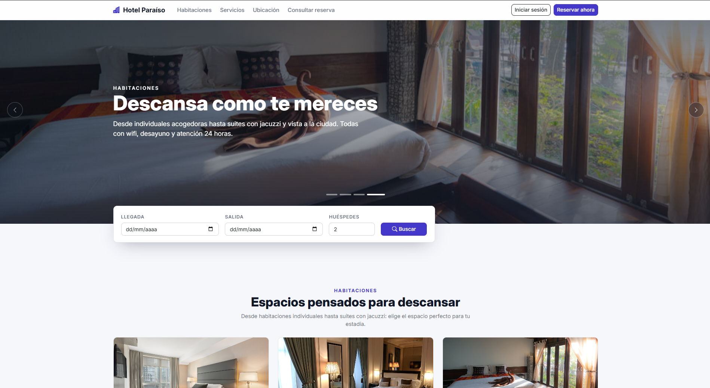
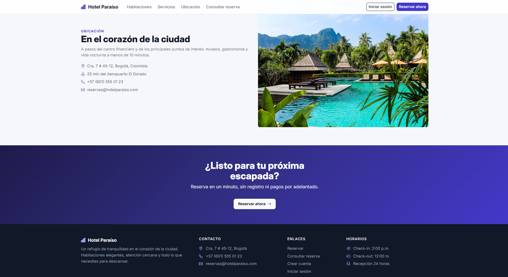
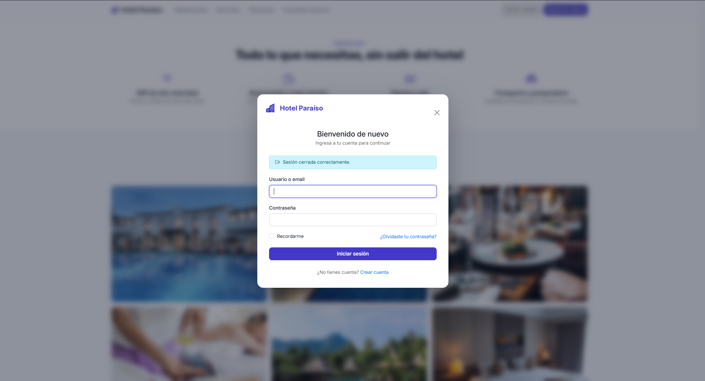
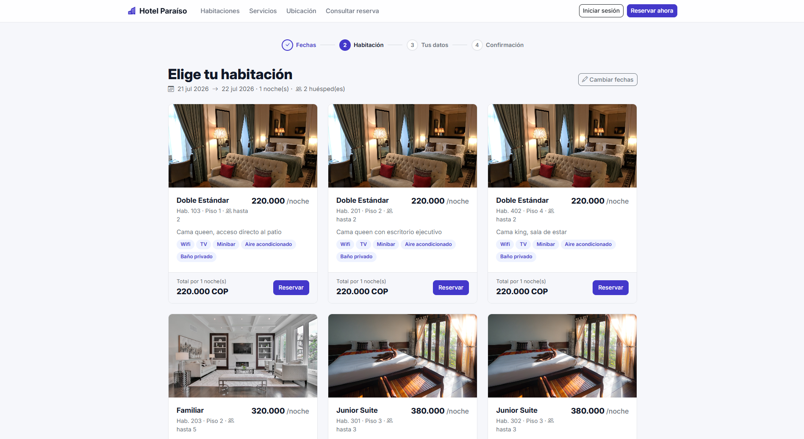
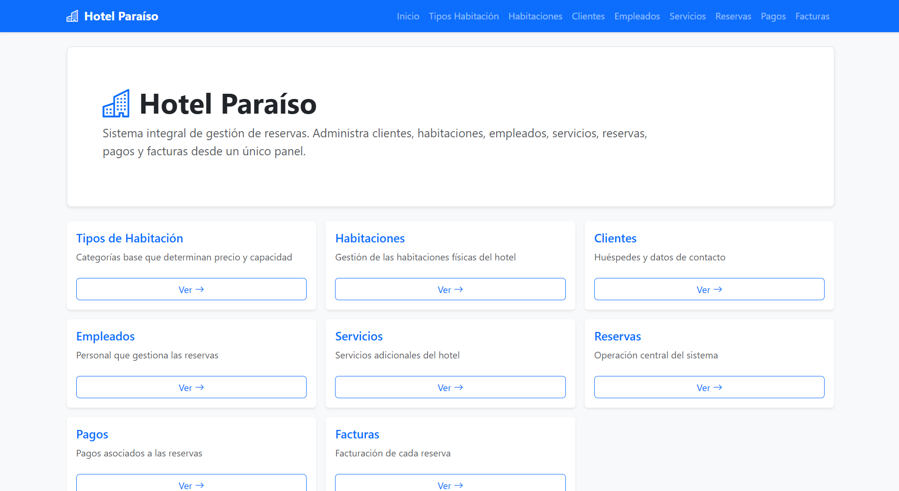
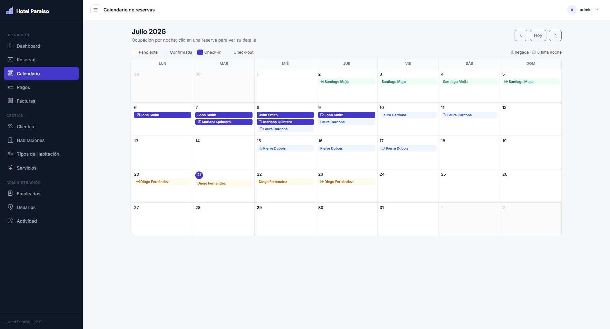
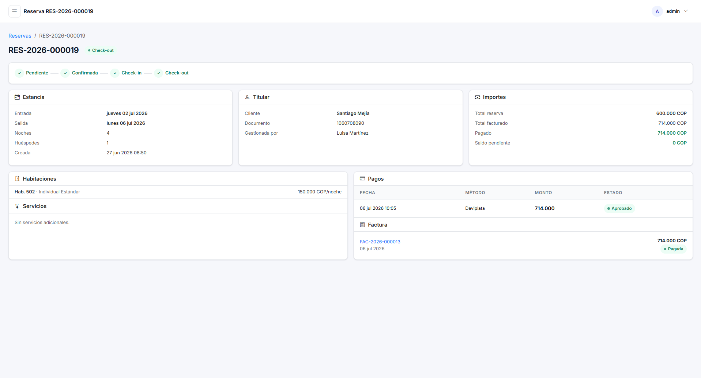

# Hotel Paraíso — Plataforma Hotelera · v2.1

Aplicación **full-stack** para la operación de un hotel: **portal público de reservas para huéspedes** (landing page, disponibilidad en línea, reserva como invitado o con cuenta) + back-office completo con reservas con máquina de estados, facturación con IVA, pagos parciales, calendario de ocupación, dashboard con métricas y control de acceso por roles.

**Stack:** Java 17 · Spring Boot 4.1 (Framework 7, Security 7, Jackson 3) · Spring Data JPA · Flyway 12 · PostgreSQL 16+ · Thymeleaf · Bootstrap 5 (vendorizado) · Chart.js · MapStruct · Lombok · Testcontainers.

---

## Características

### Portal público (huéspedes)
- **Landing page** de marketing en `/`: hero, habitaciones con fotos y comodidades, servicios, galería, testimonios, ubicación y CTAs — sin exigir login.
- **Flujo de reservas sin registro** (`/reservar`): fechas → disponibilidad real (excluye solapes bajo la misma regla que el back-office) → tarjetas con foto/precio/total de estancia → datos del huésped → código de confirmación. El invitado queda registrado como cliente por su email (get-or-create, sin duplicados).
- **Consulta de reserva por código + email** (`/consulta-reserva`), con mensaje único anti-enumeración.
- **Rol `CLIENTE` con portal propio** (`/mi-cuenta`): resumen, historial, detalle con saldos, cancelación (solo PENDIENTE/CONFIRMADA) y edición de perfil. Los clientes inician sesión con su **email**.
- **Login, registro y recuperación en un modal sobre el portal**: iniciar sesión, crear cuenta o recuperar la contraseña abre un modal (fondo desenfocado, login ⇄ registro ⇄ recuperación sin salir) sobre la página actual — sin cambio de página; los errores y el éxito se muestran dentro del propio modal y, tras entrar, el visitante permanece donde estaba. **No hay páginas de autenticación independientes**: `/login`, `/registro` y `/recuperar` son redirecciones al portal con el modal ya abierto (`/?auth=login|registro|recuperar`).
- **Registro con verificación de email opcional**: la cuenta de cliente nace activa y puede entrar de inmediato. Si el email no tenía ficha, esta se crea y vincula en el propio registro; si el email ya tenía ficha (un huésped que reservó sin cuenta), la cuenta queda activa pero **sin vincular** hasta verificar el email — así, registrar el correo de otra persona nunca expone su documento ni sus reservas. El enlace de verificación es de un solo uso (24 h) y se envía por correo real si hay SMTP configurado, o por log en su defecto.
- **Tres zonas de seguridad**: pública / cliente (`/mi-cuenta/**`) / back-office (todo lo demás, default-cerrado con `anyRequest().hasAnyRole("ADMIN","RECEPCIONISTA")`). La API `/api/**` es exclusiva del personal.

### Operación
- **Reservas** con máquina de estados (`PENDIENTE → CONFIRMADA → CHECKIN → CHECKOUT`, con `CANCELADA` y `NO_SHOW`) y acciones contextuales en la interfaz.
- **Disponibilidad garantizada bajo concurrencia**: verificación de solapamiento de fechas con bloqueo pesimista — dos recepcionistas no pueden reservar la misma habitación para las mismas noches.
- **Check-in/check-out sincronizado** con el estado físico de las habitaciones (`OCUPADA`/`DISPONIBLE`).
- **Calendario mensual** de ocupación renderizado en servidor, con chips por estado y navegación por mes.
- **Facturación** con IVA configurable (19 % por defecto), descuentos validados (nunca totales negativos) y numeración por secuencia de base de datos (sin colisiones).
- **Pagos parciales** validados contra el saldo pendiente bajo lock; el estado de la factura (`PENDIENTE → PAGADA_PARCIALMENTE → PAGADA`) se deriva automáticamente de los pagos aprobados.
- **Dashboard** con KPIs del día (ocupación, llegadas, salidas, ingresos del mes, facturas por cobrar) y gráficos de 12 meses (Chart.js con datos inline, sin fetch).

### Plataforma
- **Autenticación** con Spring Security: login con sesiones, remember-me, registro público y recuperación de contraseña por token de un solo uso (30 min). Los correos transaccionales (verificación y recuperación) se envían por SMTP real cuando se configura `MAIL_HOST`, o se emiten por log en desarrollo (`common/email/EmailSender` con implementaciones `SmtpEmailSender`/`LogEmailSender`).
- **Roles** `ADMIN` y `RECEPCIONISTA` con autorización por rutas y a nivel de método (`@PreAuthorize`).
- **CSRF activo** en todos los formularios; la API REST usa HTTP Basic y responde 401/`ProblemDetail` JSON.
- **Registro de actividad** (`activity_log`): reservas, transiciones, pagos, facturas, usuarios y accesos — persistido solo si la transacción confirma (`@TransactionalEventListener AFTER_COMMIT`).
- **Auditoría JPA** uniforme (`creado_en`, `actualizado_en`, `creado_por`, `actualizado_por`) desde el usuario autenticado.
- **Listados** con búsqueda, filtros combinables (Specifications), ordenamiento con lista blanca, paginación y **exportación CSV** que respeta los filtros vigentes.
- **Esquema versionado con Flyway** (única fuente de verdad; `ddl-auto=validate`).
- **UI tipo SaaS** con design system propio, assets 100 % locales (sin CDN), validación visual por campo, estados vacíos, modales de confirmación y toasts.

---

## Capturas de pantalla

### Portal público (huéspedes)

**Landing** — hero, buscador de disponibilidad y catálogo de habitaciones con foto y comodidades.



**Ubicación y llamada a la acción** — sección de ubicación y footer del portal.



**Inicio de sesión en modal** — login/registro sobre la página actual, sin cambio de página.



**Reserva sin registro** — paso «Elige tu habitación» del wizard, con disponibilidad real y total de estancia.



### Back-office (operación)

**Dashboard** — KPIs del día e ingresos/reservas de los últimos 12 meses (Chart.js con datos inline).



**Calendario de ocupación** — ocupación por noche con chips por estado y navegación por mes.



**Detalle de reserva** — estancia, titular, importes, habitaciones, pagos y factura vinculada.



---

## Puesta en marcha

### Requisitos
- JDK 17+
- Maven 3.9+
- PostgreSQL 14+ en `localhost:5432`

### Pasos

```bash
# 1. Crear la base de datos (Flyway crea el esquema y los datos al arrancar)
psql -U postgres -c "CREATE DATABASE hotel_paraiso;"

# 2. Ejecutar (perfil dev por defecto: incluye datos de demostración)
mvn spring-boot:run

# 3. Abrir
#    UI:  http://localhost:8080
#    API: http://localhost:8080/api/... (HTTP Basic)
```

### Credenciales iniciales (solo desarrollo — cambiar en producción)

| Usuario                    | Contraseña     | Rol           |
|----------------------------|----------------|---------------|
| `admin`                    | `admin123`     | ADMIN         |
| `recepcion`                | `recepcion123` | RECEPCIONISTA |
| `cliente@hotelparaiso.com` | `cliente123`   | CLIENTE (portal de huéspedes) |

### Perfiles

| Perfil | Uso | Notas |
|--------|-----|-------|
| `dev` (por defecto) | Desarrollo local | Datos demo (`db/seed-dev`), SQL en log, credenciales con defaults |
| `prod` | Producción | Sin defaults de credenciales; requiere `DB_URL`, `DB_USERNAME`, `DB_PASSWORD`, `REMEMBER_ME_KEY`; caché de plantillas activa; `flyway.clean-disabled` |

```bash
# Ejemplo producción
SPRING_PROFILES_ACTIVE=prod DB_URL=jdbc:postgresql://host:5432/hotel_paraiso \
DB_USERNAME=app DB_PASSWORD=*** REMEMBER_ME_KEY=*** java -jar target/hotel-paraiso-2.0.0.jar
```

---

## Arquitectura

**Package-by-feature**: cada módulo agrupa entidad, repositorio, DTOs, mapper (MapStruct), servicio y controladores (REST + vista).

```
src/main/java/com/hotel/paraiso/
├── cliente/           Cliente + repo + specs + DTOs + mapper + service + controllers
├── empleado/          (misma estructura)
├── habitacion/        Habitacion y TipoHabitacion (cohesión de catálogo)
├── servicio/          Servicios adicionales
├── reserva/           Reserva + máquina de estados + CalendarioService
├── facturacion/       Factura y Pago (reglas cruzadas de saldo/estado)
├── dashboard/         Métricas agregadas (consultas nativas, sin entidades en memoria)
├── portal/            Cara pública: landing, wizard /reservar, consulta por código,
│   └── cuenta/        y portal del huésped /mi-cuenta (rol CLIENTE)
├── security/          Usuario, roles, SecurityConfig (3 zonas), registro de huéspedes
│                      con verificación de email, recuperación, admin de cuentas
└── common/
    ├── audit/         AuditableEntity, AuditorAware, ActivityLog + listeners de eventos
    ├── crud/          AbstractCrudService (CRUD genérico de catálogos), BaseRepository, CrudMapper
    ├── exception/     Excepciones + ApiExceptionHandler (ProblemDetail) + MvcExceptionHandler
    ├── mapper/        Configuración central de MapStruct (unmapped = ERROR)
    ├── validation/    @RangoFechasValido (error visible sobre fechaSalida)
    └── web/           PageResponse, SortWhitelist, CsvExporter, atributos globales de vista
```

### Decisiones técnicas relevantes

| Tema | Decisión |
|------|----------|
| CRUD repetido | `AbstractCrudService<E, REQ, RES>` solo para los 5 catálogos; Reserva/Pago/Factura tienen servicios dedicados (su lógica de dominio no cabe en una abstracción genérica) |
| Mapeo | MapStruct con `unmappedTargetPolicy = ERROR`: si una entidad gana un campo y el mapper no lo contempla, el build falla |
| Códigos de negocio | Secuencias PostgreSQL (`seq_codigo_reserva`, `seq_numero_factura`): generación atómica, sin race conditions |
| Concurrencia | Locks pesimistas para disponibilidad y saldo + `@Version` (lock optimista) en Reserva/Pago/Factura/Habitación |
| N+1 | `@EntityGraph` (to-one) en listados; el detalle de reserva se carga con 3 consultas fetch constantes |
| Búsqueda | `JpaSpecificationExecutor` con specs componibles por módulo; sort saneado por lista blanca |
| Errores API | RFC 7807 (`ProblemDetail`) con manejadores para validación, type-mismatch, integridad, locking y acceso |
| Errores UI | Reglas de negocio → mensaje flash en la página anterior; páginas 403/404/500 propias |
| Frontend | Thymeleaf + fragments tipados (`th:field`/`th:errors`); Bootstrap, iconos, Chart.js y fuente Inter servidos localmente |

---

## API REST

Autenticación: HTTP Basic (o sesión del navegador). Listados paginados: `?page=&size=&sort=campo,dir` + filtros.

| Recurso | Base | Extras |
|---------|------|--------|
| Tipos de habitación | `/api/tipos-habitacion` | `?q=` |
| Habitaciones | `/api/habitaciones` | `?q=&estado=&tipoHabitacionId=` · `GET /disponibles?entrada&salida` |
| Clientes | `/api/clientes` | `?q=` · `GET /search?termino=` |
| Empleados (ADMIN) | `/api/empleados` | `?q=` |
| Servicios | `/api/servicios` | `?q=&categoria=` · `GET /categoria/{cat}` |
| Reservas | `/api/reservas` | `?q=&estado=&clienteId=&desde=&hasta=` · `GET /codigo/{codigo}` · `PATCH /{id}/estado` |
| Pagos | `/api/pagos` | `?estado=&reservaId=` · `GET /reserva/{id}` |
| Facturas | `/api/facturas` | `?q=&estado=` · `GET /reserva/{id}` |

Códigos: `400` validación/parámetros, `401` sin autenticación, `403` sin permisos/CSRF, `404` no encontrado, `409` conflicto de datos o concurrencia, `422` regla de negocio.

---

## Pruebas

```bash
mvn test         # unitarias (Mockito): máquina de estados, precios, saldos, IVA, descuentos
mvn verify       # + integración con Testcontainers (requiere Docker; se omiten sin él)
```

- `ReservaServiceTest`, `PagoServiceTest`, `FacturaServiceTest`: reglas de negocio puras (máquina de estados, saldos, IVA, descuentos).
- `ReservaPublicaServiceTest`, `CuentaClienteServiceTest`: reserva pública sin registro y área del huésped (`/mi-cuenta`).
- `RegistroClienteServiceTest`, `VerificacionEmailServiceTest`: registro con verificación opcional y vinculación diferida de la ficha de cliente.
- `ReservaRepositoryIT`: solapamiento de fechas y secuencias contra PostgreSQL real (Testcontainers).
- `SecurityFlowIT`: redirecciones al modal de auth, 401 de la API, separación de zonas por rol y CSRF (MockMvc).

---

## Estructura de la base de datos

Migraciones en `src/main/resources/db/migration`:

- `V1__esquema_base.sql` — dominio completo: tablas, CHECKs, FKs con políticas, índices, columnas de auditoría, `version` (lock optimista) y secuencias de códigos.
- `V2__seguridad_auditoria.sql` — `usuarios`, `password_reset_tokens`, `activity_log`.
- `V3__seed_admin.sql` — usuario administrador inicial (hash bcrypt vía `pgcrypto`).
- `V4__portal_publico.sql` — rol `CLIENTE`, vínculo `usuarios.cliente_id`, verificación de email (`tokens_verificacion_email` con payload de la ficha pendiente), `imagen`/`comodidades` en tipos de habitación.
- `V5__verificacion_email_opcional.sql` — la verificación de email pasa a ser **opcional**: las cuentas de cliente nacen activas y la ficha se crea en el registro, así que el token deja de diferir su carga — elimina de `tokens_verificacion_email` las columnas de payload que introdujo V4 (`nombre`, `apellido`, `tipo_documento`, `numero_documento`, `telefono`).
- `db/seed-dev/V1000__datos_demo.sql`, `V1001__usuarios_demo.sql`, `V1002__portal_demo.sql` — datos de demostración (solo perfil `dev`; fuera del árbol `db/migration` para que prod nunca los aplique). En dev `flyway.out-of-order=true`: las migraciones reales nuevas (V5…) siempre quedan "detrás" de los seeds V1000+.
